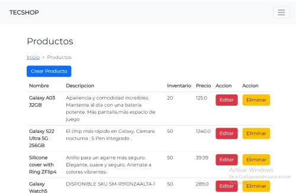

# Ecommerce

Ecommerce completo usando Spring MVC

## Tecnologías
<ul><li>Java</li><li>Spring Framework</li><li>Spring Boot</li><li>Servicios REST</li><li>Thymeleaf</li><li>Spring MVC</li><li>Spring Data JPA</li><li>Spring Security</li><li>HTML</li><li>CSS</li><li>Bootstrap 5</li><li>PostgreSQL</li>
</ul>
